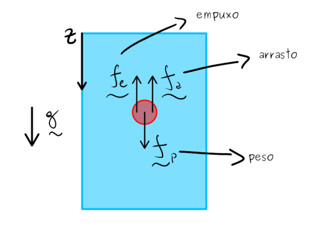
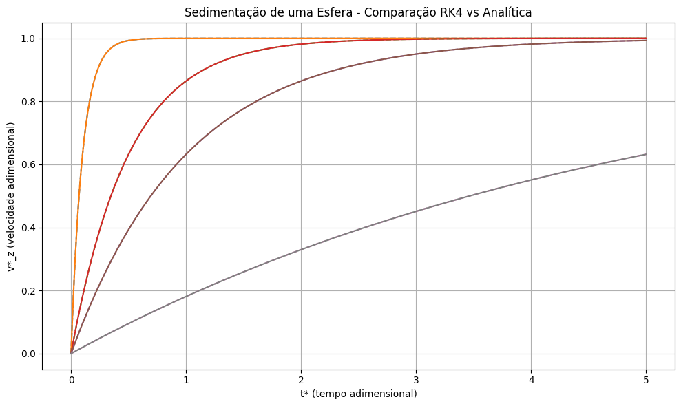
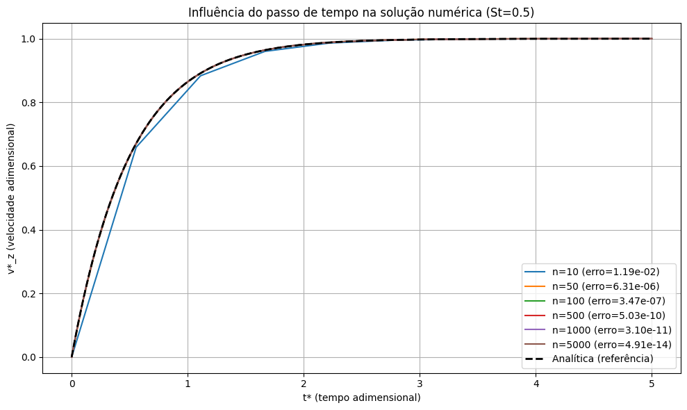
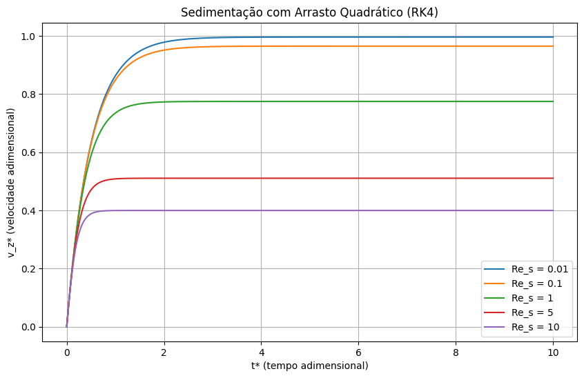
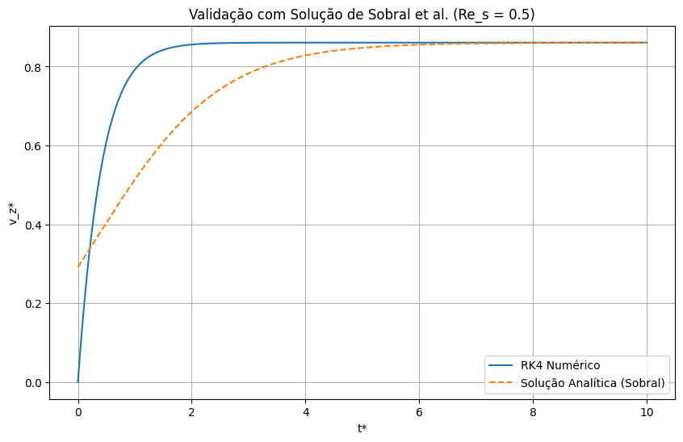
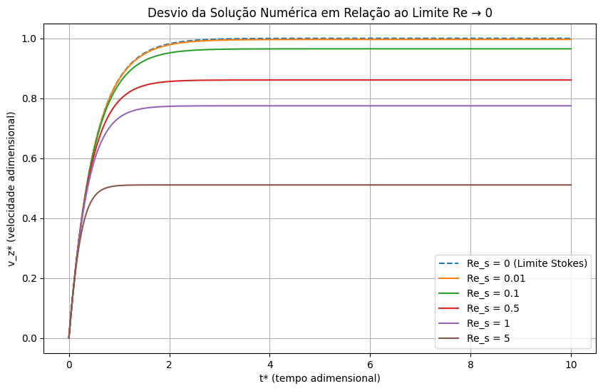
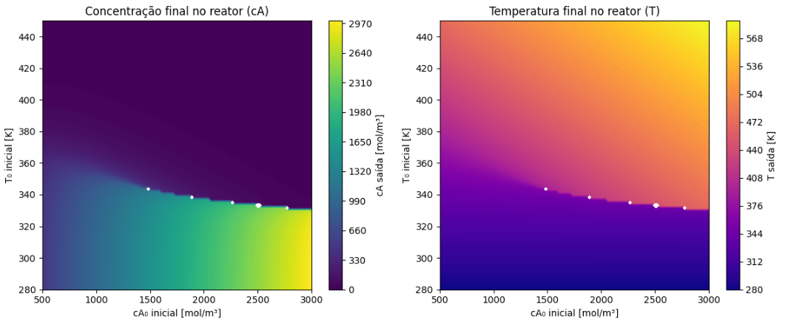
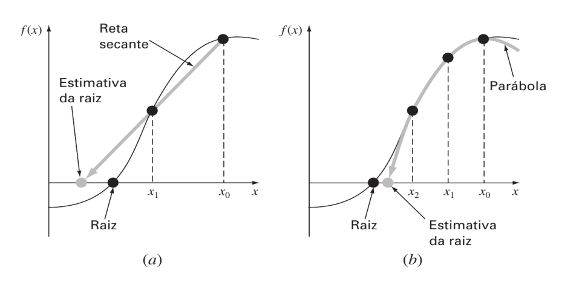
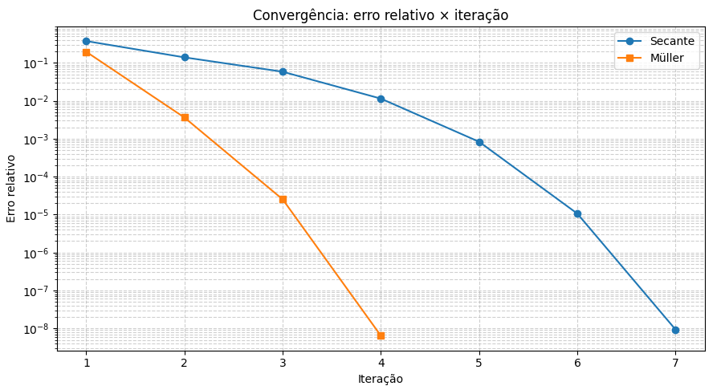

# MÉTODOS NUMÉRICOS EM CIÊNCIAS MECÂNICAS

**Aluno:** Carlos Eduardo Leite de Oliveira

**Professor:** Dr. Rafael Gabler Gontijo 

Universidade de Brasília - Departamento de Engenharia Mecânica

Grupo Vortex - Mecânica dos Fluidos de Escoamentos Complexos

Repositório destinado ao armazenamento e descrição dos códigos desenvolvidos para as atividades da disciplina de Métodos Numéricos em Ciências Mecânicas.

Os códigos apresentados nesse repositório são todos feitos em linguagem de programação Python, onde foi escolhido o Google Colab que é um ambiente de notebooks Jupyter baseado na nuvem que permite ao usuário: 

- Escrever e executar código Python diretamente no navegador; 
- Usar GPUs e TPUs gratuitamente para tarefas computacionais intensivas; 
- Compartilhar e colaborar em tempo real, como em um Google Docs;
- Acessar bibliotecas como NumPy, pandas, Matplotlib, TensorFlow, etc., sem instalação local.

Para utilizar o Google Colab, basta acessar o site https://colab.research.google.com e fazer login com sua conta do Google. Com isso, é possível criar notebooks para cada atividade, desenvolver os códigos e executá-los em qualquer máquina com acesso à internet.

## Código 1 - Sedimentação de uma esfera em um fluido viscoso

### Teoria
O código apresentado tem por objetivo a resolução de sedimentação de uma esfera em um fluido viscoso onde será aplicado o Método de Runge-Kutta de 4a ordem. Como é apresentado no esquematico da Figura 1.

  
   
  <em>Figura 1: Esquemático do problema de sedimentação.</em>

Para esse problema é considerando a força de arrasto, empuxo e peso. A segunda lei de Newton aplicada a este problema é:

$$
m_p \frac{dv_z}{dt} = -6 \pi \eta a v_z - \frac{9}{4} \pi \rho_r a^2 v_z^2 + \frac{4}{3} \pi a^3 \Delta \rho g
$$

Na sua forma adimensional é:

$$
\mathrm{St} \frac{d v_{z}^{\ast}}{d t^{\ast}} = 1 - v_{z}^{\ast}
$$

A solução exata é dada por:

$$
v_{z}^{\ast}(t) = 1 - e^{-t/\mathrm{St}}
$$

### Resultados

Para resolver a sedimentaçãoo de uma esfera em baixo Reynolds na sua forma adimensional utilizando o método de Runge-Kutta de quarta ordem clássico para realizar as seguintes análises:

1.   Para o caso de $Re \to 0$ compare a solução analítica com a solução exata para diferentes valores de $St$:

  
   

 
2.   Para um dado cenário varie o passo de tempo e mostre como o refinamento dessa quantidade afeta a qualidade da solução:

  
   

3.   Para um pequeno efeito inercial no fluido ($Re \neq 0$):

  
   

4.   Validação do código com base na solução exata para o problema:

  
   

5.   Plote do comportamento da solução numérica para diferentes valores de $\text{Re}_s$ e mostre como a solução numérica se desvia do limite assintótico em que $Re \to 0$.

  
   

Todos os resultados apresentados podem ser reproduzidos a partir do código disponibilizado no [📂 Programa 01](https://github.com/themestrre/Metodos-Numericos/tree/main/Programas/Programa%2001)

## Código 2 - Estudo de caso: reator contínuo de tanque agitado (CSTR)

### Teoria

O comportamento do CSTR pode ser descrito por dois balanços fundamentais. O primeiro é pela conservação da massa e o segundo é pela utilização da primeira lei da termodinâmica.

Balanço de Massa:

$$
c_{A_{in}} - c_A = \tau k(T) c_A
$$

Essa equação expressa a conservação da massa para o reagente A, relacionando a diferença entre a concentração de entrada e saída com a taxa de reação química no interior do tanque.

Balanço de Energia:

$$
\rho c_p \dot{Q}(T_e - T) - U A (T - T_c) = -\Delta H V k(T) c_A
$$

Essa equação representa a Primeira Lei da Termodinâmica, aplicando-se à energia do sistema. O termo à esquerda contabiliza o calor trocado com o fluxo de entrada e o calor removido pela camisa de resfriamento, enquanto o termo à direita representa o calor liberado pela reação.

A não linearidade desse sistema se faz por meio do modelo que iremos utilizar para modelar a cinética da
reação e segue a lei de Arrhenius:

$$
k(T) = k_0 \exp\left(-\frac{E}{R T}\right)
$$

### Resultados

O código utiliza o método de Newton-Raphson para achar o estado estacionário do reator — isto é, a concentração e temperatura de saída (cA e T) para cada condição de entrada (cA₀ e T₀).

Na tabela abaixo, temos para algumas condições de entrada, como a concentração e temperatura de saída se comportam.

  
   

O código faz uma varredura contínua em uma faixa de valores de entrada (cA₀ e T₀) e plota dois mapas de contorno, o primeiro representa a concentração de saída cA (mostra como a concentração final muda conforme as condições iniciais) e o segundo a temperatura de saída T (mostra como a temperatura final do reator varia).

  
   

Todos os resultados apresentados podem ser reproduzidos a partir do código disponibilizado no [📂 Programa 02](https://github.com/themestrre/Metodos-Numericos/blob/main/Programas/Programa%2002)

## Código 3 - Aplicação do Método da secante e Müller

### Teoria

O método da secante propõe uma aproximação do valor da derivada da função utilizando um esquema simples e direto de diferenças finitas, onde aproxima a raiz usando dois pontos anteriores:

$$
x_{i+1} = x_i - \frac{f(x_i)\.(x_{i-1} - x_i)}{f(x_{i-1}) - f(x_i)}
$$

O método de Müller, concebido para ser uma extensão do método da secante, em que ao invés de seccionarmos a função f(x), cuja raiz desejamos obter, por uma reta utilizando dois pontos, fazemos isso por meio de uma parábola utilizando três pontos: 

$$
x_{i+1} = x_i - \frac{2c}{b \pm \sqrt{b^2 - 4ac}}
$$

Onde:

$$
a = \frac{\delta_1 - \delta_0}{h_1 - h_0}, 
\quad b = ah_1 + \delta_1, 
\quad c = f(x_2)
$$

$$
h_0 = x_1 - x_0, 
\quad h_1 = x_2 - x_1, 
\quad \delta_0 = \frac{f(x_1) - f(x_0)}{x_1 - x_0}, 
\quad \delta_1 = \frac{f(x_2) - f(x_1)}{x_2 - x_1}
$$

Para a análise de comparação de forma graficamente entre o método da Secante e Müller, temos na Figura 2.

  
   
  <em>Figura 2: Diferença entre o método da secante (a) e o método de Müller (b).</em>

### Resultados

Para esse caso vamos aplicar os métodos da Secante e Müller para fazer suas comparações e encontrar a raiz de um polinômio dado. A comparação será baseada no erro relativo (%) a cada iteração até que a tolerância desejada seja atingida.

  
   

Todos os resultados apresentados podem ser reproduzidos a partir do código disponibilizado no [📂 Programa 03](https://github.com/themestrre/Metodos-Numericos/tree/main/Programas/Programa%2003)

## Código 4 - 

### Teoria

### Resultados

## Código 5 - 

### Teoria

### Resultados
